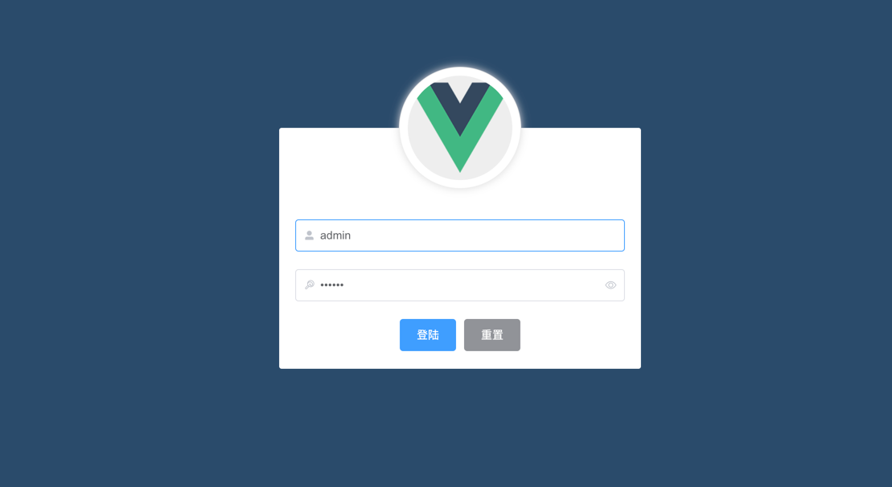
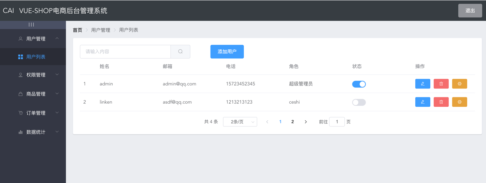
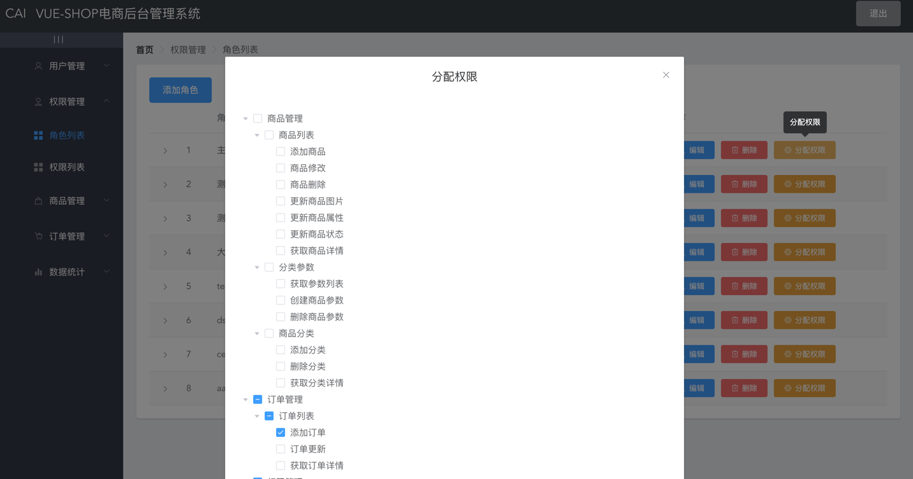
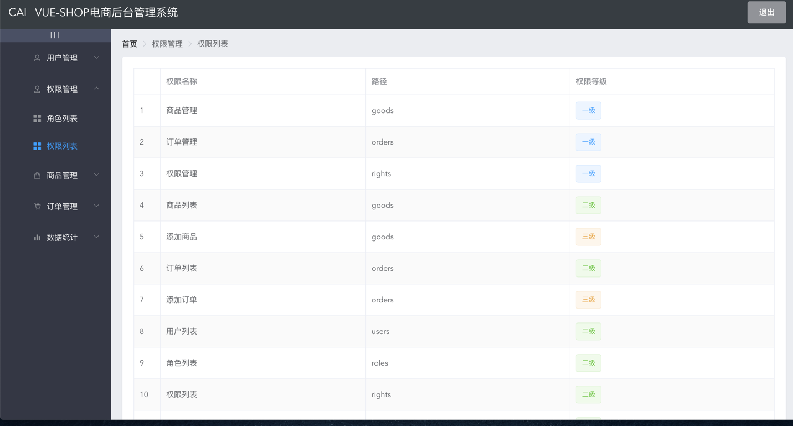
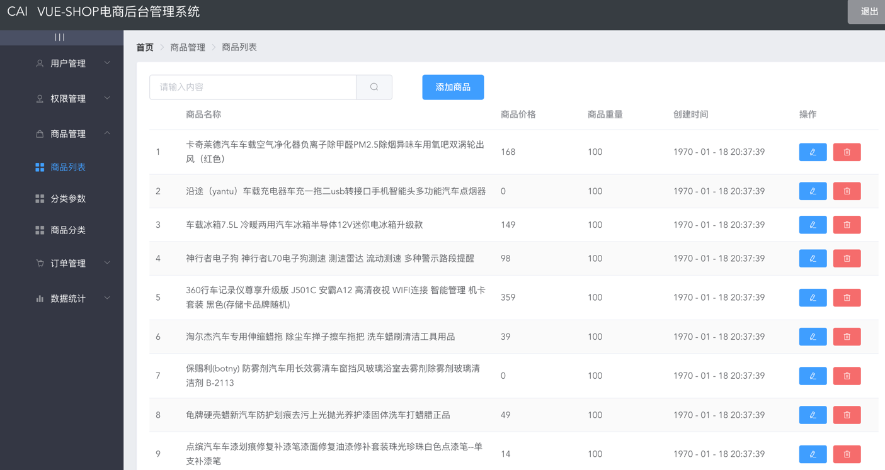
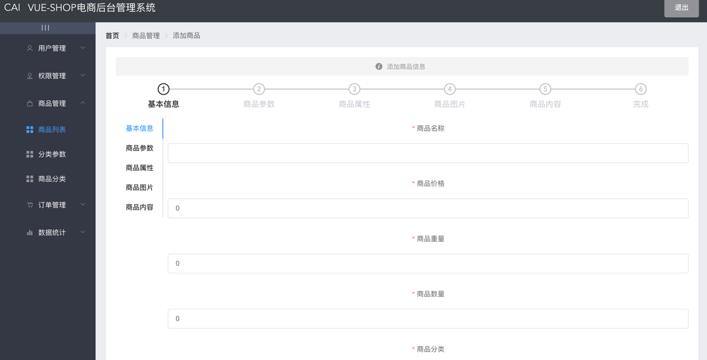
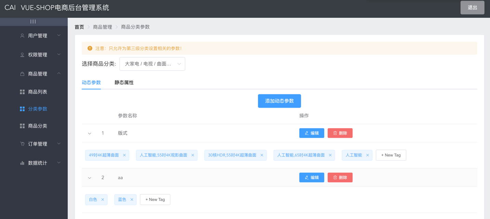
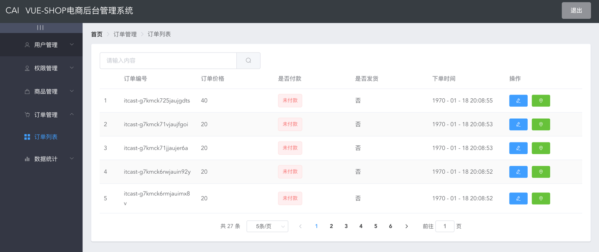
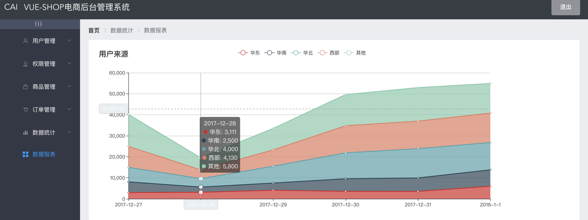

# vue_shop
### Import db
```Import db
import server/db/my.db
```
## Project setup
```
npm install
```

### Start node server
```
cd server
node ./app.js
```

### Compiles and minifies for production
```
npm run build
```

### Compiles and hot-reloads for development
```
npm run serve
```
### 访问
```
http://localhost:8080/#/login
admin/123456
```

### Login


### User


### Role


### Permission


### Goods




### Cate


### Order


### Echarts


### Customize configuration
See [Configuration Reference](https://cli.vuejs.org/config/).
